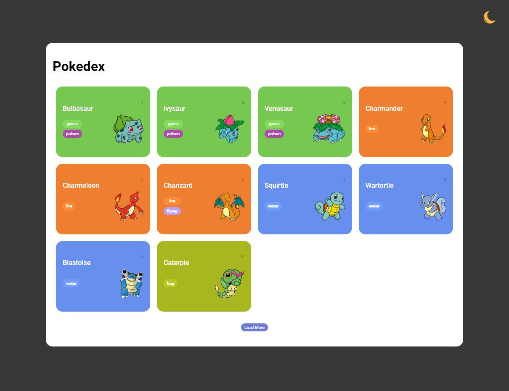
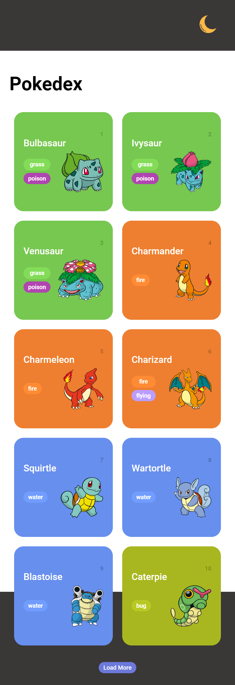

# Pokedex Trilha JS DIO

## Sobre o projeto
Projeto com o intuíto de criarmos uma Pokedex utilizando uma API para aprimorarmos nossos conceitos sobre o consumo de uma API, consistindo em demonstrar determinadas informações sobre o pokemon selecionado.

    <h2>Versão Desktop 💻</h2>
    
    <h2>Versão Mobile 📱</h2>
    

## 🚀 Tecnologias Utilizadas 
- HTML
- CSS
- JavaScript
- Git e GitHub

## Mais informações 
- [PokeAPI](https://pokeapi.co/)
